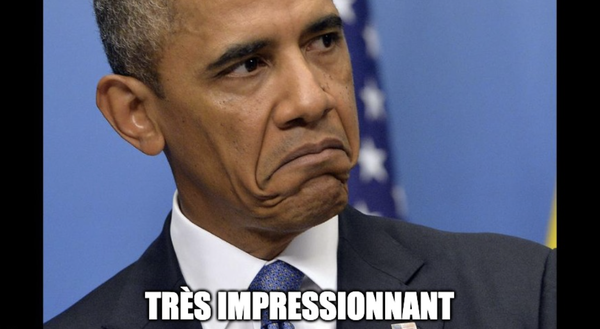
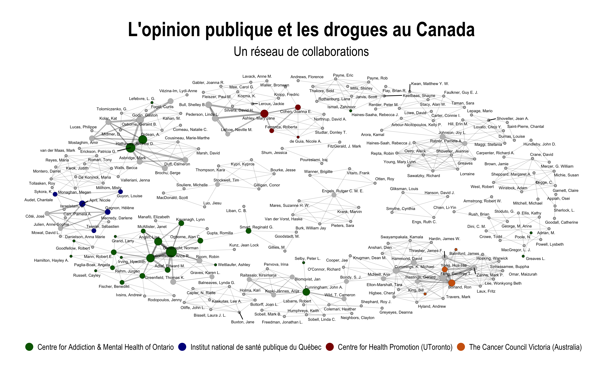
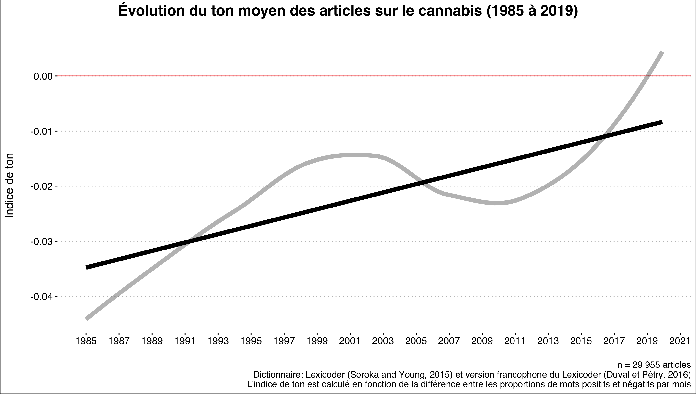
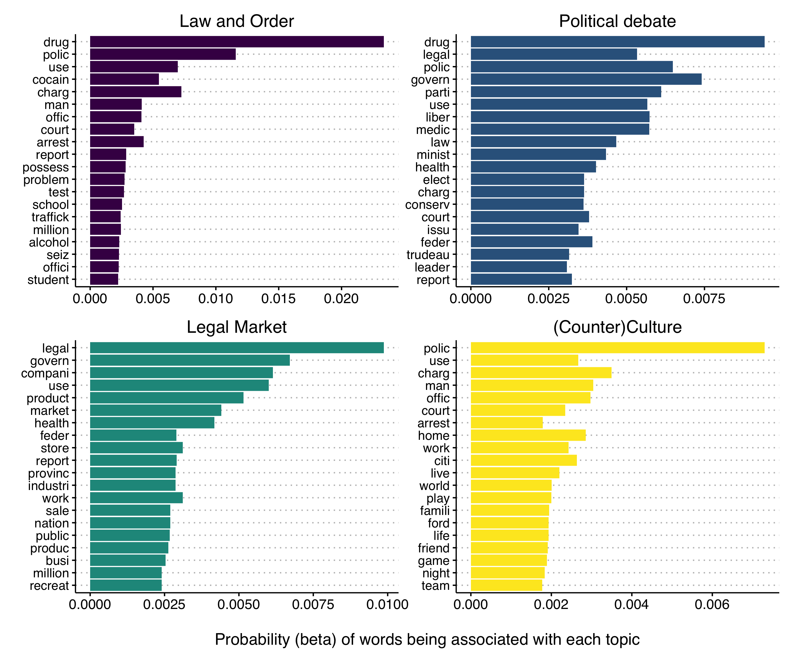
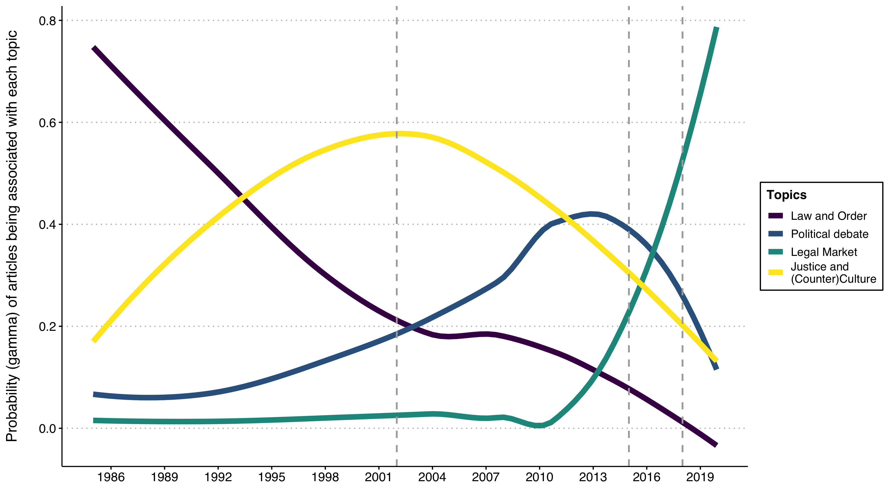
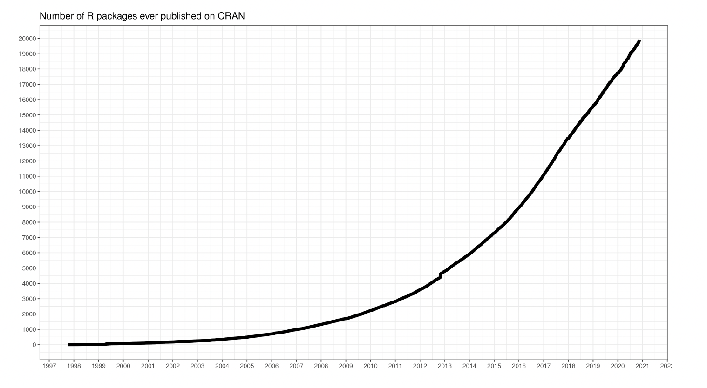
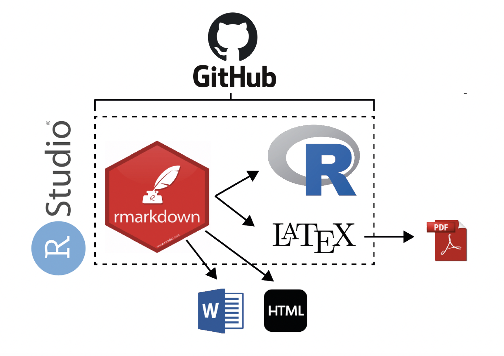
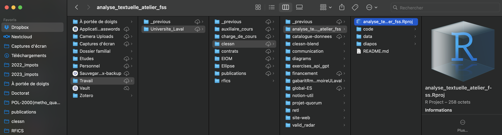
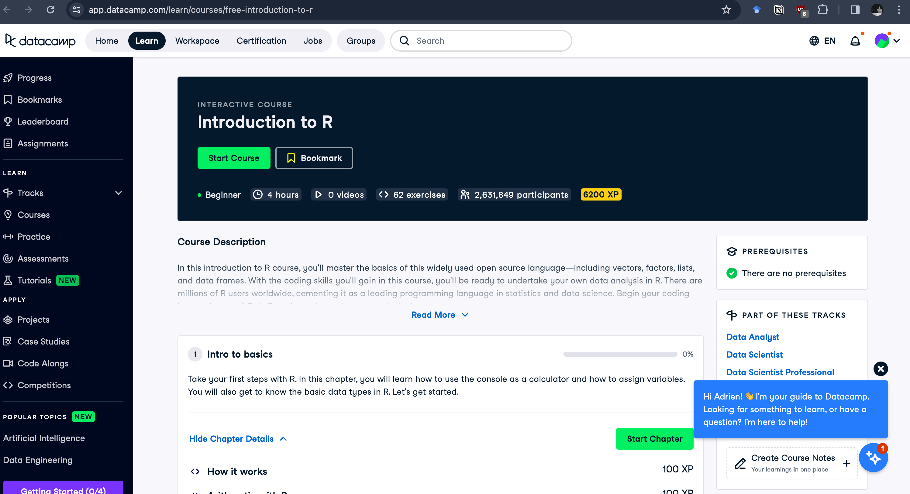
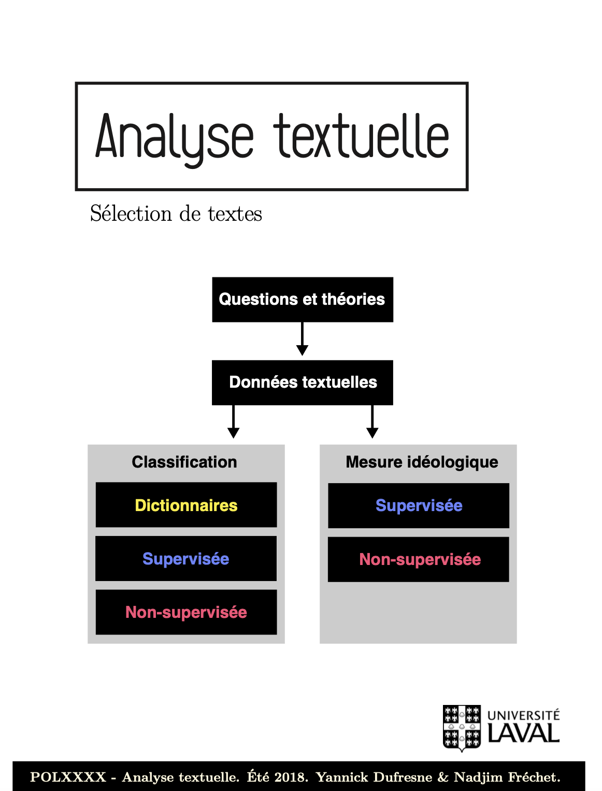

# Introduction

## Bravo d'être là!

{ width=100% height=100% }

## Plan de l'atelier

9h à 12h

- Qui suis-je
- Êtes-vous quali ou quanti?
- R et RStudio
- Des cadeaux!
- On ouvre le code

12h à 15h

- Atelier libre avec des mentors de la CLESSN
- Exercices avec R et Datacamp

# Qui suis-je?

## Qui suis-je?

- Doctorant en science politique (directeur: Yannick Dufresne)
- Membre de la Chaire de leadership en enseignement des sciences sociales numériques (CLESSN)
- Coordonnateur du Réseau francophone international en conseils scientifiques (RFICS)
- Membre du Centre d'analyses des politiques publiques (CAPP)
- Membre du Groupe de recherche en communication politique (GRCP)
- Membre du Centre d'étude sur la citoyenneté démocratique (CÉCD)
- Cocréateur de l'École interdisciplinaire outils et méthodes (EIOM)
- Formation comme scrum master (méthode Agile: https://www.scrum.org/)

## Un monde aride?

{ width=100% height=100% }

## Pourquoi suivre cet atelier?
- Comprendre le monde autour de nous à travers des données
- Compétences recherchées sur le marché du travail
- Base solide pour la recherche académique
- Comprendre la pertinence du logiciel de traitement de données R 
- Obtenir des ressources pour dédramatiser la science des données

# Êtes-vous quanti ou quali?

## Une base scientifique commune

- FLSH, FSÉ, FSS, FTSR, et plus encore.
- La programmation ne sert pas uniquement au quantitatif

## Une base scientifique commune

- Mon mémoire de maitrise sur la légalisation du cannabis
- Une étude de la portée de la littérature («scoping review»)
- Analyse de réseaux d'acteurs

{ width=90% height=90% }

## Une base scientifique commune

- Mon mémoire de maitrise sur la légalisation du cannabis
- Analyse par dictionnaire (mots positifs et mots négatifs)

{ width=70% height=70% }

## Une base scientifique commune

- Mon mémoire de maitrise sur la légalisation du cannabis
- Topic modeling (analyse textuelle automatisée)

{ width=70% height=70% }

## Une base scientifique commune

- Mon mémoire de maitrise sur la légalisation du cannabis
- Topic modeling (analyse textuelle automatisée)
- Évolution dans le temps des 4 thèmes générés 

{ width=70% height=70% }

## Une base scientifique commune

- Ma thèse de doctorat sur la saillance médiatique
- Nuage de mots les plus présents dans les médias

{ width=70% height=70% }

## École interdisciplinaire Outils & Méthodes (EIOM)

- **Interdisciplinaire**
- 5 jours, 3 crédits
- https://eiom.ca/

{ width=100% height=100% }

# R et RStudio

## Programmes pour l'analyse statistique

{ width=100% height=100% }

## R (un langage de programmation)

{ width=85% height=85% }

## R Studio/Posit (un environnement de développement)

{ width=85% height=85% }

## Chemin d'arborescence (le fameux « path »)

{ width=100% height=100% }

## Vos meilleurs amis

- Google
- Stackoverflow
- r-bloggers
- Coursera
- DataCamp
- Datanovia
- Chaines Slack _aide-métho
- ... ChatGPT..!

# C'est l'heure des cadeaux

## Datacamp

{ width=100% height=100% }

## Recueil de textes sur l'analyse textuelle

{ width=80% height=80% }

## En résumé

- Utilisez les ressources à votre disposition
- EIOM
- Clinique d'aide métho
- ChatGPT

# On ouvre RStudio
